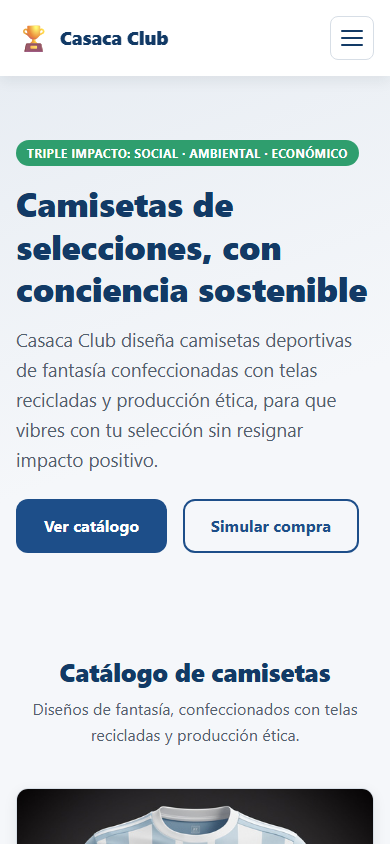
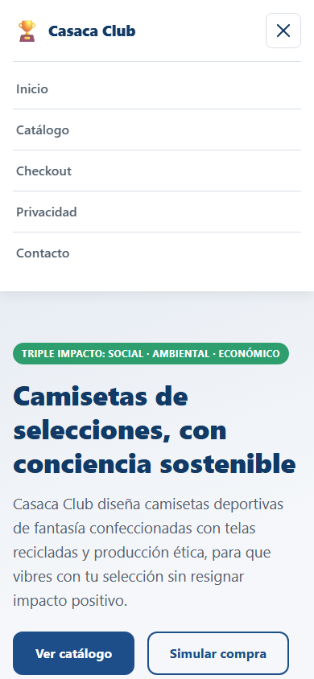
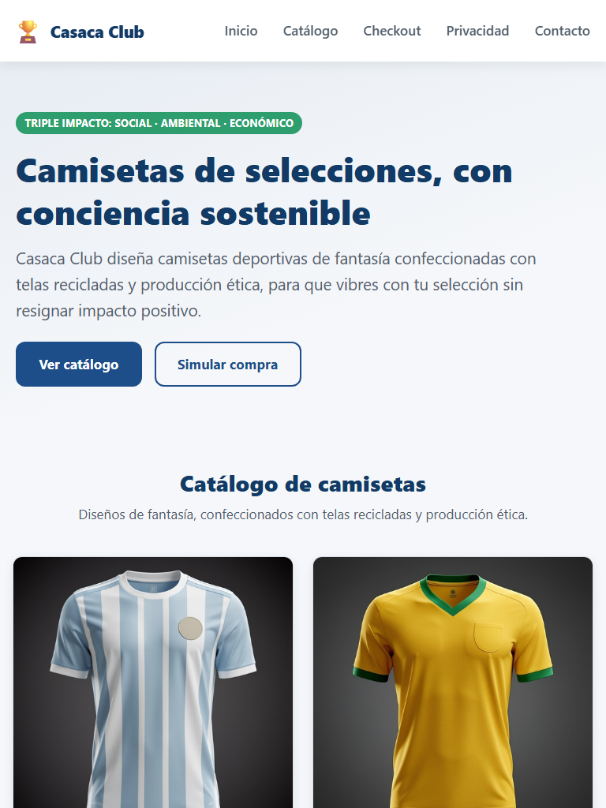
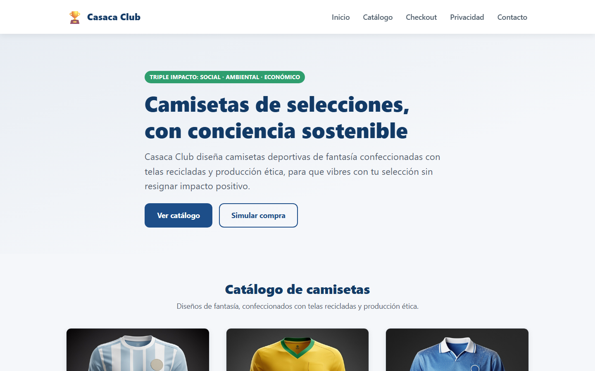

# Casaca Club – Pruebas de usabilidad responsive (Sprint 2)

**Fecha:** 28/09/2026 · **Consigna:** Semana 6 del Sprint 2 – *"Pruebas de usabilidad responsive visual del e-commerce"*

El sitio de Casaca Club se adapta correctamente a móvil, tablet y escritorio: en los tres anchos probados no hay desbordes horizontales, textos cortados ni elementos superpuestos.

## Alcance

- **Sitio probado:** `casaca-club-sprint2/index.html` (rama `sprint_2`, con el menú hamburguesa agregado tras la primera ronda de pruebas).
- **Secciones revisadas:** encabezado y menú, portada (hero), catálogo de camisetas, formulario de checkout, Política de Privacidad y footer.
- **Fuera del alcance:** navegadores distintos de Chrome, pruebas con usuarios reales y rendimiento de carga.

## Metodología

Las capturas se tomaron con **Google Chrome en modo headless** (sin interfaz gráfica), abriendo el archivo local `index.html` en tres anchos de pantalla.

| Dispositivo | Ancho × alto (px) | Referencia | Breakpoint CSS que aplica |
| --- | --- | --- | --- |
| Móvil | 390 × 844 | iPhone 12 a 15 | Estilos base (menos de 768 px) |
| Tablet | 768 × 1024 | iPad vertical | `@media (min-width: 768px)` |
| Escritorio | 1440 × 900 | Notebook o monitor | `min-width: 1024px` y `1200px` |

Por cada dispositivo hay dos capturas:

- **Vista inicial:** lo que el usuario ve al abrir la página, sin hacer scroll.
- **Página completa:** todo el sitio de arriba abajo, recortado al final del footer.

En móvil se agregó una tercera captura con el menú hamburguesa abierto.

**Corrección aplicada en móvil:** Chrome headless en Windows no permite ventanas de menos de unos 500 px de ancho, por lo que la primera captura de 390 px salió cortada a la derecha (el sitio no tenía ese problema). Para obtener un ancho real de 390 px, el sitio se cargó dentro de un `iframe` de ese ancho exacto y la imagen se recortó con Python (Pillow).

## Resultados en móvil (390 px)

En móvil todo el contenido se apila en una sola columna y entra en el ancho de la pantalla. La página completa mide 8.277 px de alto.

- **Encabezado:** logo a la izquierda y botón hamburguesa (44 × 44 px) a la derecha. El encabezado fijo ocupa unos 76 px (9 % de la pantalla).
- **Menú abierto:** al tocar el botón, los 5 enlaces se despliegan en una lista vertical con áreas de toque amplias y el ícono pasa a una "X". El menú se cierra al elegir una sección o con la tecla Escape.
- **Portada:** el título baja a 3 líneas con tipografía fluida (`clamp()`). Los dos botones entran lado a lado.
- **Catálogo:** 1 camiseta por fila (`minmax(260px, 1fr)`). Las fotos son cuadradas y se ven completas.
- **Checkout:** todos los campos ocupan el ancho completo, uno debajo del otro.
- **Privacidad:** las 6 cláusulas en una sola columna.
- **Footer:** los bloques de marca, enlaces, contacto y licencia se apilan.

Página completa: [`movil-pagina-completa.png`](movil-pagina-completa.png)

## Resultados en tablet (768 px)

Desde 768 px el menú sube a la línea del logo y el catálogo, el formulario y la privacidad pasan a 2 columnas. La página completa mide 5.314 px de alto.

- **Encabezado:** el botón hamburguesa se oculta y el menú vuelve a mostrarse completo, a la derecha del logo en una sola fila (`order` y `flex-basis: auto`).
- **Portada:** el título baja a 2 líneas y los botones no se parten (`flex-wrap: nowrap`).
- **Catálogo:** 2 camisetas por fila (`minmax(280px, 1fr)`), 3 filas en total.
- **Checkout:** nombre y correo lado a lado; lo mismo camiseta y cantidad.
- **Privacidad:** grilla de 2 columnas; "Derechos ARCO" y "Aviso legal obligatorio" ocupan todo el ancho (`grid-column: 1 / -1`).
- **Footer:** marca, enlaces y contacto en una fila; la licencia pasa a la fila siguiente.

Página completa: [`tablet-pagina-completa.png`](tablet-pagina-completa.png)

## Resultados en escritorio (1440 px)

El contenido se centra con un ancho máximo de 1200 px: el catálogo pasa a 3 columnas y el footer queda en una sola fila. La página completa mide 4.644 px de alto.

- **Encabezado:** igual que en tablet, con más aire lateral desde 1200 px.
- **Portada:** texto limitado a 820 px de ancho para una lectura cómoda.
- **Catálogo:** 3 camisetas por fila (`minmax(300px, 1fr)`), 2 filas.
- **Checkout:** formulario centrado de 760 px de ancho máximo.
- **Privacidad:** grilla de 2 columnas.
- **Footer:** los 4 bloques en una sola fila (`flex-wrap: nowrap`).

Página completa: [`escritorio-pagina-completa.png`](escritorio-pagina-completa.png)

## Comparativa por sección

| Sección | Técnica CSS | Móvil (390 px) | Tablet (768 px) | Escritorio (1440 px) | Resultado |
| --- | --- | --- | --- | --- | --- |
| Encabezado y menú | Flexbox + JS | Botón hamburguesa, lista vertical al abrir | Logo y menú en 1 fila | Logo y menú en 1 fila | Correcto |
| Portada (hero) | Flexbox + `clamp()` | Título en 3 líneas | Título en 2 líneas | Título en 2 líneas, más aire | Correcto |
| Catálogo | CSS Grid `auto-fit` | 1 columna | 2 columnas | 3 columnas | Correcto |
| Checkout | Flexbox | Campos apilados | Campos de a pares | Campos de a pares, 760 px máx. | Correcto |
| Privacidad | CSS Grid | 1 columna | 2 columnas | 2 columnas | Correcto |
| Footer | Flexbox | Bloques apilados | 3 + 1 bloques | 4 bloques en 1 fila | Correcto |

## Conclusiones y mejoras propuestas

La prueba se considera **aprobada**: el sitio cumple la consigna de diseño adaptable con Flexbox y CSS Grid en los tres dispositivos, sin frameworks externos. No se detectaron errores de maquetación.

**Mejora ya aplicada:** en la primera ronda el encabezado fijo ocupaba unos 215 px de 844 en móvil (25 % de la pantalla) porque el menú usaba dos renglones. Se reemplazó por un menú hamburguesa y ahora ocupa unos 76 px. Sin JavaScript el menú sigue visible como antes (mejora progresiva).

**Observaciones de usabilidad para próximos sprints:**

| Observación | Dónde | Mejora propuesta |
| --- | --- | --- |
| La foto de espalda aparece al pasar el mouse; en pantallas táctiles sólo se ve al tocar la tarjeta. | Móvil y tablet | Agregar un botón o indicador visible de "Ver espalda". |
| En tablet, el bloque de licencia del footer queda solo en una segunda fila. | Tablet | Footer en grilla de 2 × 2 entre 768 y 1023 px. |

**Pruebas pendientes:**

- [ ] Revisar el sitio en Firefox, Safari y Edge.
- [ ] Probar en un celular real, además de la simulación.
- [ ] Prueba corta con 2 o 3 usuarios que completen una compra simulada.
