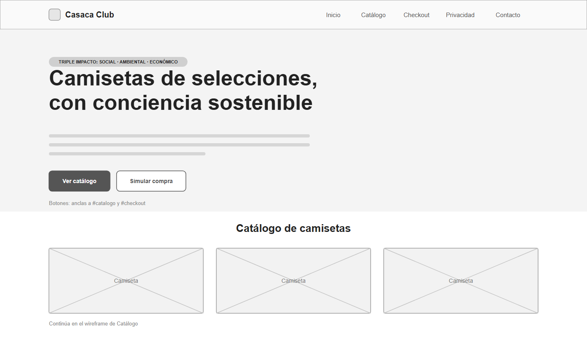
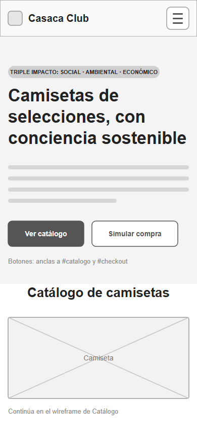
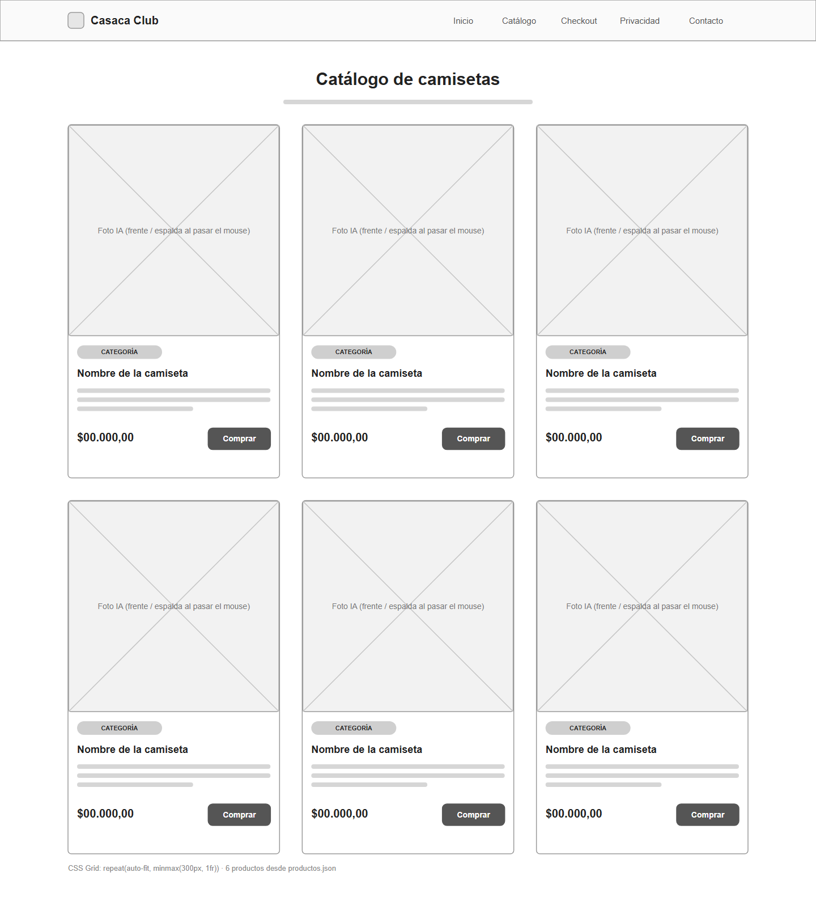
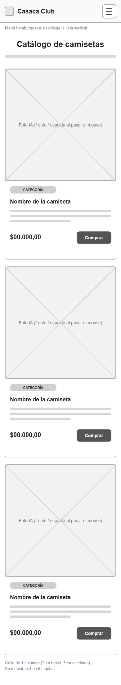
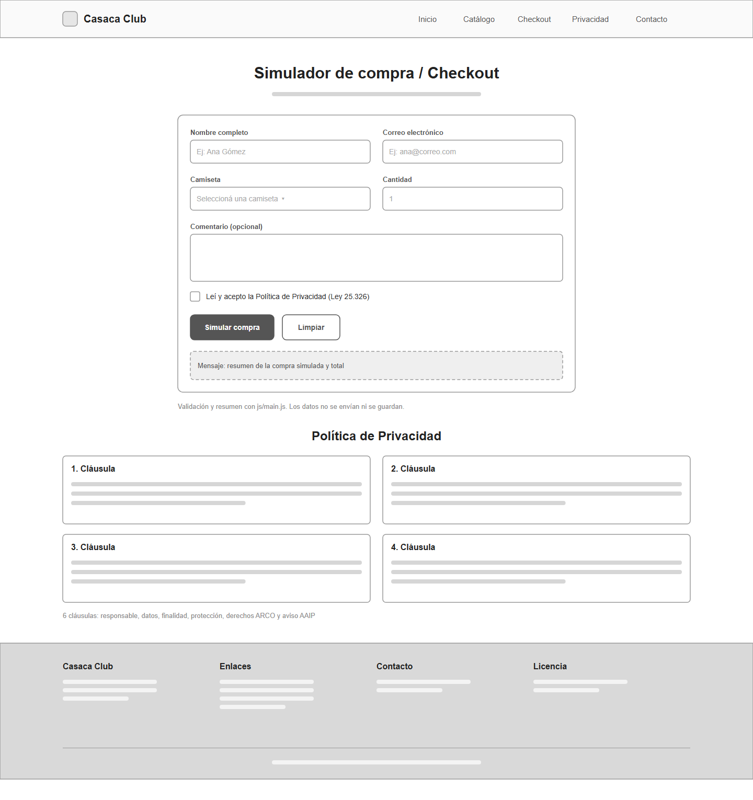
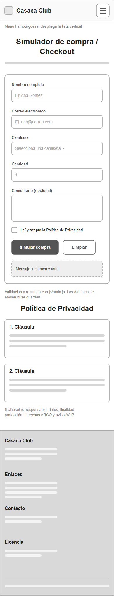

# Casaca Club – Wireframes de baja fidelidad

**Archivo de Figma:** [Casaca Club – Wireframes](https://www.figma.com/design/62kpNAD4oCUv20J5ySf0bN/Casaca-Club-%E2%80%93-Wireframes?node-id=0-1)

Wireframes de las tres pantallas críticas que pide la consigna del Sprint 1: **Portada (Home)**, **Catálogo de Productos** y **Formulario de Compra (Checkout)**. Cada pantalla está en versión escritorio (1440 px) y móvil (390 px), y corresponde al sitio entregado en `casaca-club-sprint2/`.

Son maquetas de baja fidelidad: sólo escala de grises, cajas con una cruz en lugar de imágenes y barras grises en lugar de texto corrido. Así se evalúa la disposición de los elementos sin distraerse con colores ni contenido. Las notas en gris claro explican el comportamiento de cada zona.

| # | Pantalla | Escritorio (1440 px) | Móvil (390 px) |
| --- | --- | --- | --- |
| 1 | Portada (Home) | `01-home-escritorio` | `01-home-movil` |
| 2 | Catálogo | `02-catalogo-escritorio` | `02-catalogo-movil` |
| 3 | Checkout | `03-checkout-escritorio` | `03-checkout-movil` |

Cada wireframe está en dos formatos: **SVG**, que se importa en Figma como vectores editables, y **PNG**, para ver en GitHub o pegar en la carpeta de la entrega.

## Estructura común

Las tres pantallas comparten el encabezado fijo:

- **Escritorio:** logo "Casaca Club" a la izquierda y menú con 5 enlaces (Inicio, Catálogo, Checkout, Privacidad y Contacto) a la derecha.
- **Móvil:** logo a la izquierda y botón hamburguesa a la derecha; al tocarlo, el menú se despliega como lista vertical.

## 1. Portada (Home)

| Escritorio | Móvil |
| --- | --- |
|  |  |

Primera pantalla que ve el visitante. Presenta la propuesta de la marca y lo lleva al catálogo o al checkout.

- **Etiqueta:** "Triple impacto: social · ambiental · económico", que resume el enfoque de la startup.
- **Título principal:** "Camisetas de selecciones, con conciencia sostenible" (2 líneas en escritorio, 3 en móvil).
- **Texto de presentación:** 3 o 4 líneas sobre las telas recicladas y la producción ética.
- **Botones:** "Ver catálogo" (principal, relleno) y "Simular compra" (secundario, con borde). Son enlaces internos a `#catalogo` y `#checkout`.
- **Anticipo del catálogo:** debajo aparece el comienzo de la grilla de camisetas, que invita a seguir bajando.

## 2. Catálogo de productos

| Escritorio | Móvil |
| --- | --- |
|  |  |

Muestra las 6 camisetas cargadas en `productos.json`.

- **Grilla:** 3 columnas en escritorio, 2 en tablet y 1 en móvil, con CSS Grid (`repeat(auto-fit, minmax(...))`). En móvil se dibujan 3 tarjetas como muestra.
- **Tarjeta de producto**, de arriba abajo:
    - foto cuadrada generada con IA; al pasar el mouse cambia de la vista de frente a la de espalda;
    - etiqueta de categoría (Selecciones Clásicas, Retro Sostenible o Edición Especial);
    - nombre de la camiseta;
    - descripción de 2 o 3 líneas;
    - precio simulado y botón "Comprar", que lleva al checkout con esa camiseta ya elegida.

## 3. Formulario de compra (Checkout)

| Escritorio | Móvil |
| --- | --- |
|  |  |

Simula un pedido sin procesar pagos reales ni guardar datos.

- **Campos:** nombre completo, correo electrónico, camiseta (lista desplegable), cantidad y comentario opcional. En escritorio van de a pares (máximo 760 px de ancho); en móvil, uno debajo del otro.
- **Consentimiento:** casilla obligatoria "Leí y acepto la Política de Privacidad" (Ley 25.326).
- **Botones:** "Simular compra" (principal) y "Limpiar" (secundario).
- **Mensaje de resultado:** recuadro que muestra el resumen del pedido y el total, o un aviso si falta completar algún campo.
- **Política de Privacidad:** debajo del formulario, en tarjetas (2 columnas en escritorio, 1 en móvil). Son 6 cláusulas; en el wireframe se dibujan 4 en escritorio y 2 en móvil como muestra.
- **Footer:** 4 bloques (marca, enlaces, contacto y licencia), en una fila en escritorio y apilados en móvil.

## En Figma

Los 6 wireframes ya están cargados en el archivo de Figma, en la página **"Wireframes – Sitio entregado"**, como frames editables: escritorio en la fila de arriba y móvil en la de abajo. La página original del archivo no se modificó.

Para volver a importar un SVG de esta carpeta, arrastralo al lienzo: Figma lo convierte en vectores y textos editables.

## Diseños anteriores

La carpeta [`prototipo-react/`](prototipo-react/) conserva los diseños de alta fidelidad del prototipo en React (rama `prototipo-react`), que no corresponden al sitio entregado.
