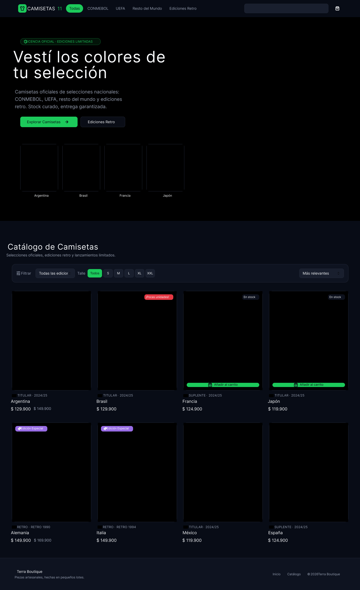
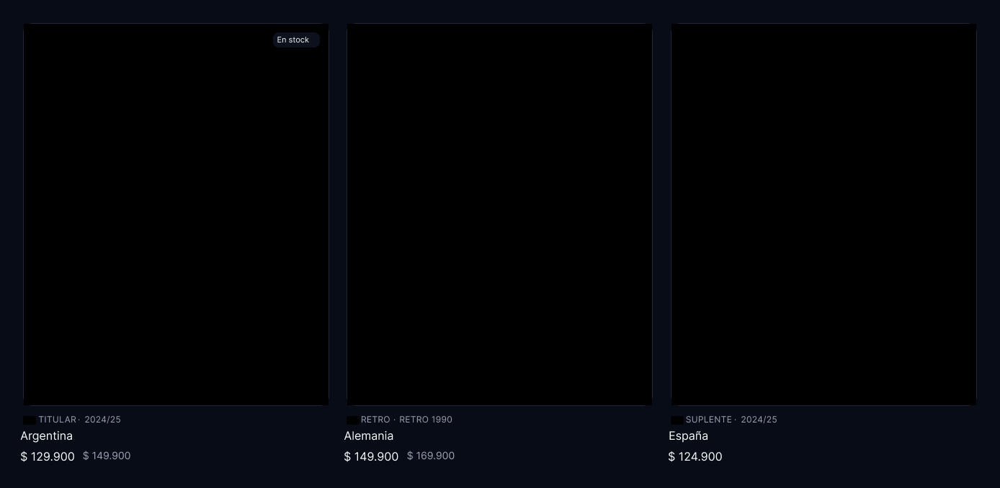
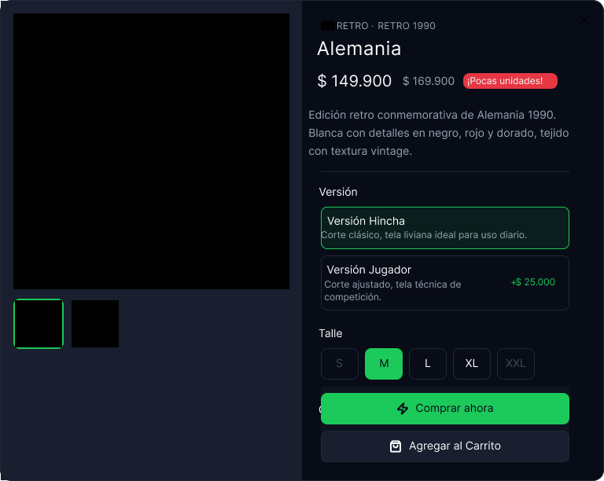
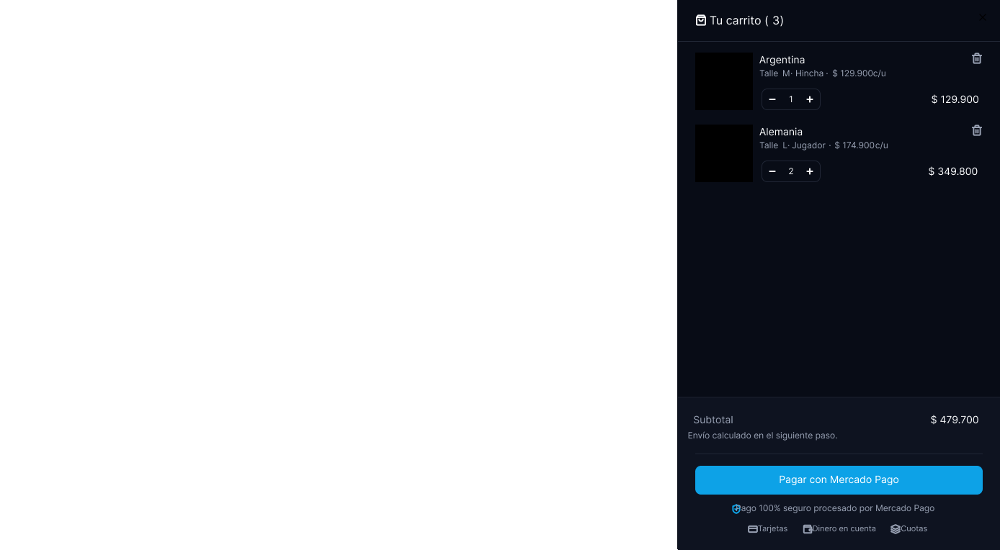
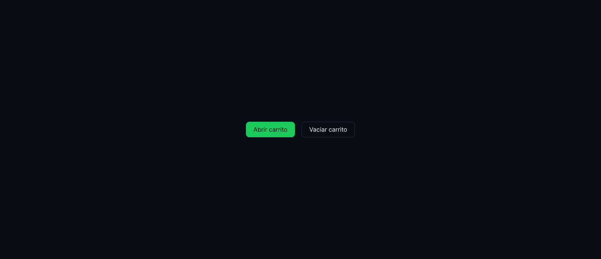
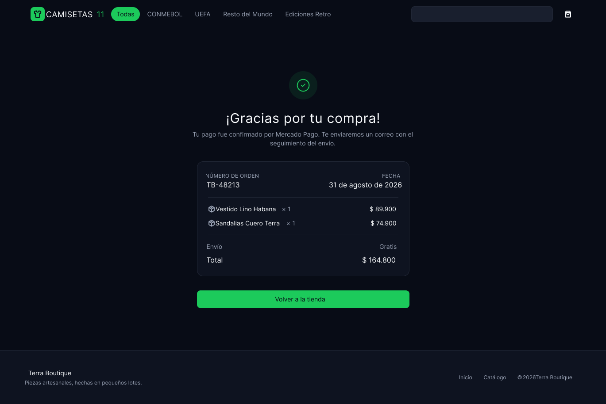
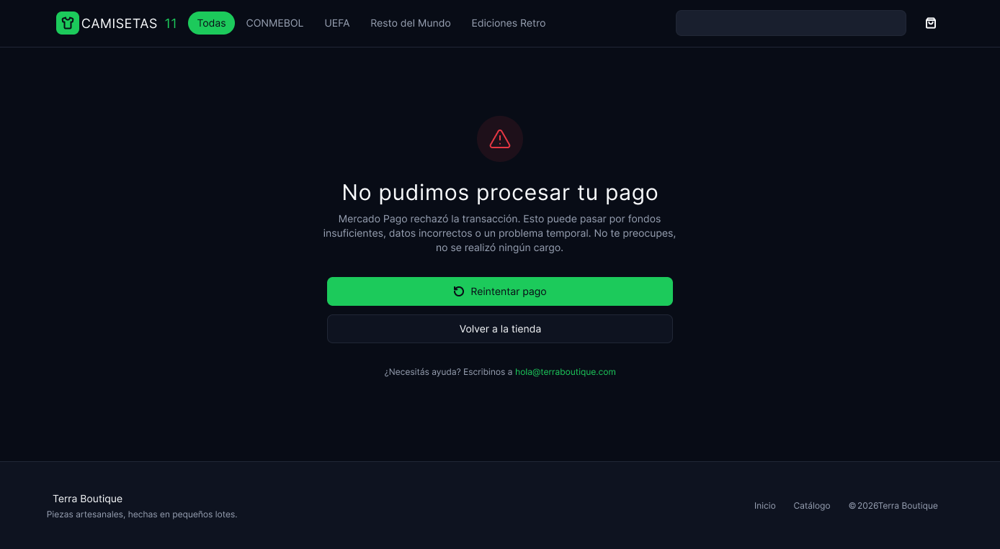

# Casaca Club – Diseños del prototipo React

> Estos diseños de alta fidelidad corresponden al prototipo en React (rama `prototipo-react`), no al sitio entregado en `casaca-club-sprint2/`. Los wireframes de baja fidelidad del sitio entregado están en la carpeta anterior (`SprintsDocs/wireframes/`). Algunos textos todavía muestran el nombre de una plantilla anterior ("Terra Boutique").

**Archivo de Figma:** [Casaca Club – Wireframes](https://www.figma.com/design/62kpNAD4oCUv20J5ySf0bN/Casaca-Club-%E2%80%93-Wireframes?node-id=0-1)

Diseño de la interfaz de la tienda de camisetas de selecciones: 7 pantallas que recorren el flujo completo de compra, desde la portada hasta el resultado del pago. Las imágenes se exportaron desde Figma y están numeradas en el orden en que el usuario las recorre.

| # | Archivo | Pantalla | Tamaño (px) |
| --- | --- | --- | --- |
| 1 | `01-home-y-catalogo.png` | Portada y catálogo | 1369 × 2241 |
| 2 | `02-catalogo-tarjetas.png` | Detalle de las tarjetas del catálogo | 1388 × 678 |
| 3 | `03-detalle-producto.png` | Ficha de producto | 768 × 612 |
| 4 | `04-carrito.png` | Carrito de compras | 1388 × 764 |
| 5 | `05-acciones-carrito.png` | Acciones del carrito | 1388 × 600 |
| 6 | `06-compra-exitosa.png` | Checkout: compra exitosa | 1369 × 914 |
| 7 | `07-pago-rechazado.png` | Checkout: pago rechazado | 1388 × 763 |

## 1. Portada y catálogo

Pantalla principal, que reúne la portada (Home) y el catálogo en una sola página.

- **Encabezado:** logo "Camisetas 11", filtros rápidos por región (Todas, CONMEBOL, UEFA, Resto del Mundo, Ediciones Retro), buscador e ícono de carrito.
- **Portada:** etiqueta "Licencia oficial · Ediciones limitadas", título "Vestí los colores de tu selección", texto de presentación y dos botones: "Explorar Camisetas" y "Ediciones Retro". Debajo, 4 accesos destacados: Argentina, Brasil, Francia y Japón.
- **Catálogo:** barra de filtros (edición, talle S a XXL y orden "Más relevantes") y grilla de 4 columnas con 8 camisetas.
- **Tarjeta de producto:** imagen, etiquetas de estado ("En stock", "¡Pocas unidades!", "Edición Especial"), tipo y temporada, nombre, precio con precio anterior tachado cuando hay descuento, y botón "Añadir al carrito" al pasar el mouse.
- **Footer:** nombre de la marca, lema y enlaces a Inicio y Catálogo.

## 2. Detalle de las tarjetas del catálogo

Ampliación de 3 tarjetas (Argentina, Alemania y España) para definir la jerarquía de cada tarjeta: imagen grande, etiqueta de stock, línea de tipo y temporada, nombre y precio, con el precio anterior en gris.

## 3. Ficha de producto

Ventana que se abre al hacer clic en una camiseta.

- **Izquierda:** imagen principal y miniaturas para cambiar de vista (frente y espalda).
- **Derecha:** tipo y año, nombre, precio con descuento y aviso "¡Pocas unidades!", y descripción del producto.
- **Versión:** "Hincha" (corte clásico) o "Jugador" (corte ajustado, +$ 25.000).
- **Talle:** botones de S a XXL; los talles sin stock aparecen deshabilitados.
- **Acciones:** "Comprar ahora" y "Agregar al Carrito".

## 4. Carrito de compras

Panel lateral que se abre desde la derecha sobre la tienda.

- **Encabezado:** "Tu carrito" con la cantidad de productos y botón para cerrar.
- **Productos:** imagen, nombre, talle, versión y precio por unidad; selector de cantidad (− / +), subtotal por línea y botón para eliminar.
- **Pie:** subtotal, aviso de que el envío se calcula en el paso siguiente, botón "Pagar con Mercado Pago" y medios de pago aceptados (tarjetas, dinero en cuenta y cuotas).

## 5. Acciones del carrito

Frame auxiliar con los botones "Abrir carrito" y "Vaciar carrito", para definir el estilo de los botones principal (verde) y secundario (con borde).

## 6. Checkout: compra exitosa

Pantalla a la que se llega cuando el pago se aprueba.

- Ícono de confirmación y título "¡Gracias por tu compra!".
- Resumen de la orden: número de orden, fecha, productos con cantidad y precio, envío y total.
- Botón "Volver a la tienda".

## 7. Checkout: pago rechazado

Pantalla a la que se llega cuando el pago no se procesa.

- Ícono de advertencia y título "No pudimos procesar tu pago".
- Explicación de las causas posibles, aclarando que no se realizó ningún cargo.
- Botones "Reintentar pago" y "Volver a la tienda", y un correo de contacto para pedir ayuda.
